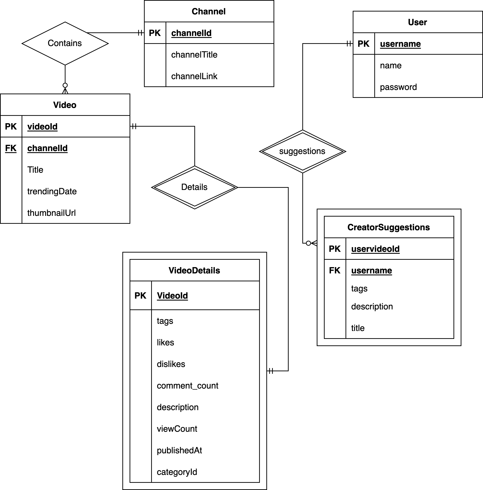

# Stage 2: Conceptual Database Design

## Description of assumptions (entities and relationships):
We have created 5 entities for our schema. This is going to be created by decomposing our Youtube Trending Videos database and combining this with our analyzing tool. 

We are going to have three entities and two weak entities that are identified by the others. Channel, Video, and VideoDetails are all a part of the information we need to create the analyzing tool, and most of this information will come from the Youtube dataset. All this information will be used to display trending videos and their content as well. Then User and CreatorSuggestions is going to be a part of storing the information that we create in the analyzing tool. The User entity contains login information and allows us to make a relationship with each suggestion we provide for that user. CreatorSuggestions contains all of the suggestions for the video to add to the tags, description, and title of the video. 

The relationships we have defined is that each video should belong to a channel, it cannot have more or less so this is identified by the videoId and connected by relationship to one channel ID. And each channel can have 0 to many videos because some channels on Youtube have nothing published yet. 

Then each video should have one video details relationship, and each video detail is identified by its video; this is a 1 to 1 mandatory relationship since each video detail is defined by the video. 

For keeping track of the users login and the actual analyzing feature, we created the relationship that creator suggestions are identified by the user using it, and each user can have generated multiple suggestions. Each suggestion belongs to one user. 

## Convert your conceptual database design (ER/UML) to the logical design (relational schema):
Channel(channelId: INT [PK], channelTitle: varchar(255), channelLink: varchar(255))

Video(videoId: INT [PK], channelId: INT [FK to Channel.channelId], title: varchar(255), trendingDate: DATE, thumbnailUrl: varchar(255))

VideoDetails(videoId: INT [PK][FK to Video.videoId], tags: varchar(255), likes: INT, dislikes: INT, commentCount: INT, description: varchar(255), viewCount: INT, publishedAt: DATE, categoryID: INT)

User(username: varchar(255) [PK], name: varchar(255), password: varchar(255))

CreatorSuggestions(uservideoId: INT [PK], username: varchar(255) [FK to User.username], tags: varchar(255), description: varchar(255), title: varchar(255))
