## **GCP Connection**
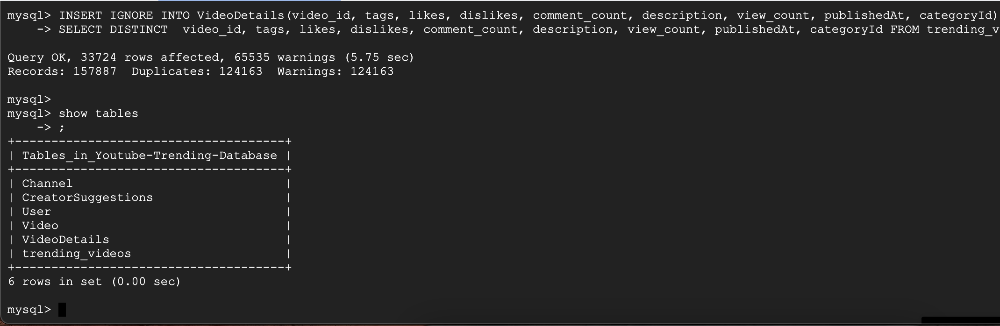
## **DDL Commands Used**
Create table Channel(channelId varchar(32) primary key NOT NULL, channelTitle varchar(128) NOT NULL, channelLink varchar(255));

Create table Video(video_id varchar(16) primary key NOT NULL, channelId varchar(32) NOT NULL, title varchar(128) NOT NULL, trending_date varchar(32), thumbnail_link varchar(255), FOREIGN KEY (channelId) REFERENCES Channel(channelId) ON DELETE CASCADE);

Create table VideoDetails(video_id varchar(16) not null primary key, tags varchar(255), likes INT, dislikes INT, comment_count INT, description varchar(1024), view_count INT, publishedAt varchar(32), categoryId INT NOT NULL, foreign key (video_id) references Video(video_id) on delete cascade);

Create table User(username varchar(255) primary key, name varchar(255), password varchar(255));

Create table CreatorSuggestions(uservideoId varchar(16), username varchar(255) , tags varchar(255), description varchar(1024), title varchar(255), primary key (uservideoId,username), foreign key (username) references User(username) on delete cascade);
## **Insert Commands Used**
INSERT IGNORE INTO Video(video_id, channelId, title, trending_date, thumbnail_link)
SELECT video_id, channelId, title, trending_date, thumbnail_link FROM trending_videos;

INSERT IGNORE INTO Channel(channelId, channelTitle) SELECT channelId, channelTitle FROM trending_videos;

INSERT IGNORE INTO VideoDetails(video_id, tags, likes, dislikes, comment_count, description, view_count, publishedAt, categoryId)
SELECT DISTINCT  video_id, tags, likes, dislikes, comment_count, description, view_count, publishedAt, categoryId FROM trending_videos;

## **Count Query to Show Inserted Data**
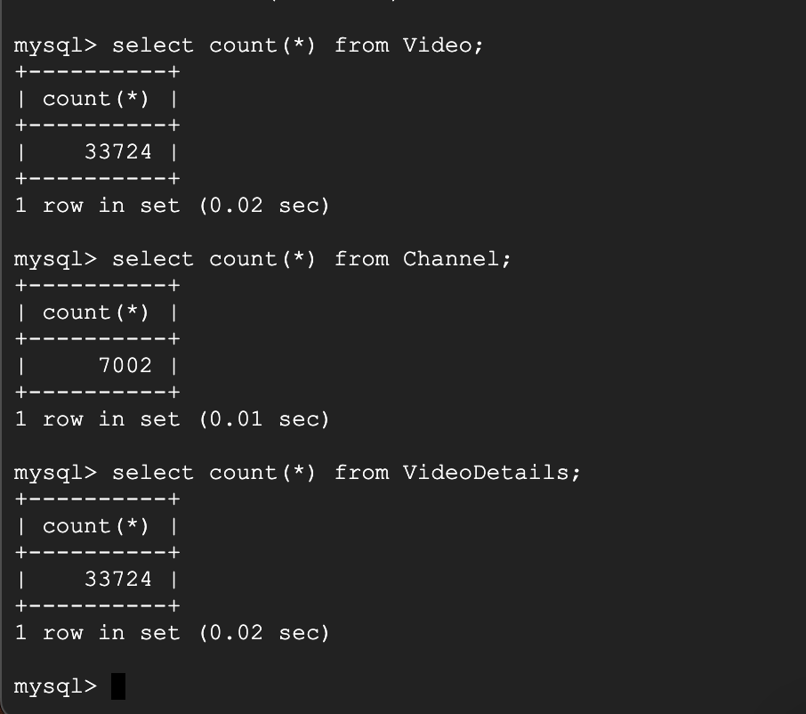
## **Advanced Queries & Results**
**Our first query will be used to return videos given a certain tag, from channels with more than one trending video in 2023. All these items will be user input (tag, number of videos trending, year) but for now we have provided just an example of what the user can input.**

SELECT video_id, channelId, trending_date 
FROM Video NATURAL JOIN VideoDetails 
WHERE tags LIKE '%art%' AND trending_date LIKE '%2023%' AND channelId IN 
(SELECT channelId FROM Video NATURAL JOIN VideoDetails GROUP BY channelId HAVING COUNT(video_id)  > 2);

Screenshot of top 15 rows returned

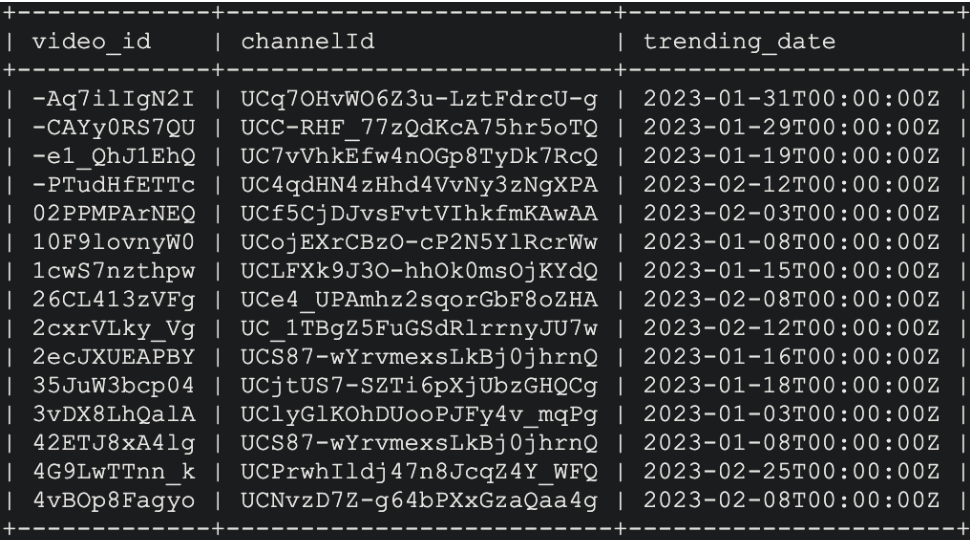

**Our second query lists videos with most engagement without including videos with 2x or greater dislikes than likes**

SELECT video_id, channelId 
FROM Video NATURAL JOIN VideoDetails 
WHERE video_id NOT IN (SELECT video_id FROM VideoDetails WHERE (dislikes/likes)<0.5) 
ORDER BY comment_count DESC, likes DESC 
LIMIT 15;

Screenshot of top 15 rows returned

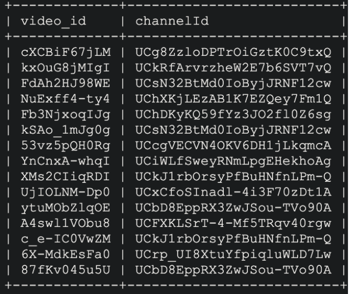

## **Indexing Analysis**
<ins>1st Advanced Query</ins>
Initial Explain Analyze:
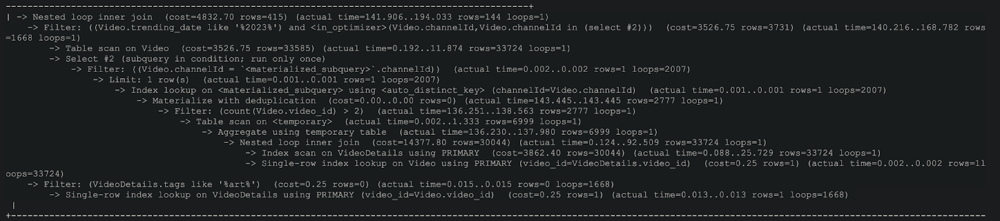

Index on Video (video_id):
We chose to add an index on video_id due to a join occurring between the Video and VideoDetails table occurring on the video_id attribute. Adding this index did not result in a change of cost.
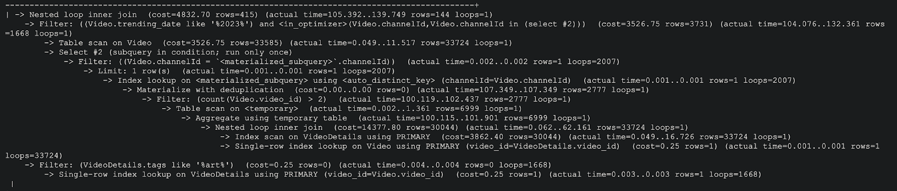

Index on Video(channelId):
We chose to add an index on channelId since the attribute is used multiple times in the WHERE clause of the query. Adding this index also did not result in a change of cost.
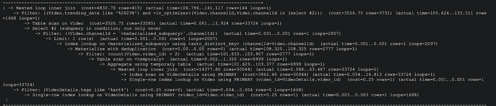

Index on Video (tags):
We chose to add an index on tags since the attribute is used in the WHERE clause of the query. Adding this index also did not result in a change of cost.
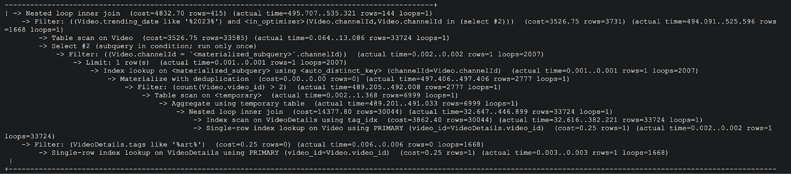

<ins>2nd Advanced Query</ins>
Initial Explain Analyze:
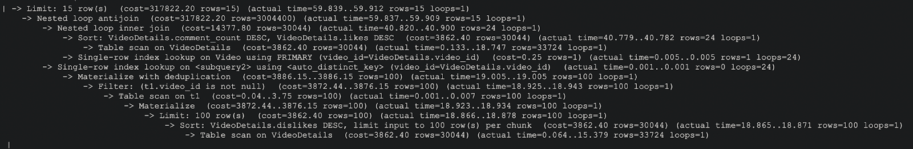

Index on Video (video_id):
We chose to add an index on tags since the attribute is used in the WHERE clause of the query, as well as it being selected in the subquery. Adding this index also did not result in a change of cost.
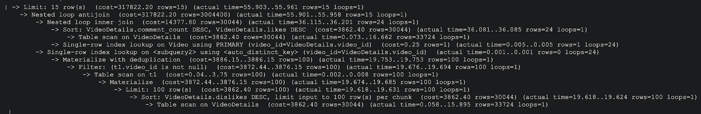

Index on VideoDetails (dislikes):
We chose to add an index on dislikes since the attribute is to order the data returned by a subquery. Adding this index also did not result in a change of cost.
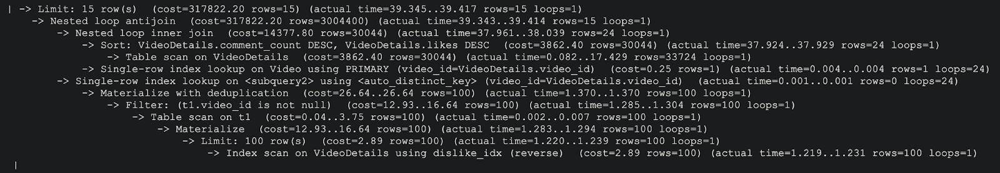

Index on VideoDetails (comment_count):
We chose to add an index on tags since the attribute is used to order the data returned by the query. Adding this index also did not result in a change of cost.
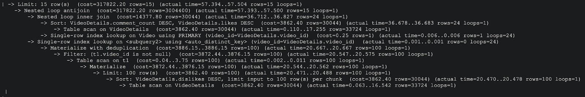

In conclusion, none of the indexes added in this query resulted in a difference in cost. This could be due to a number of factors, such as the database size not being large enough or distribution of values not being varied enough for indexes to impact the data. 

Another reason could be that the values we are looking for are already very specific and detailed in the advanced queries, therefore the indexing is not helpful. If we choose to later on generalize the advanced queries for our final web application, indexing can become more helpful when more results are returned. For example, for more general filtering and searching. 

