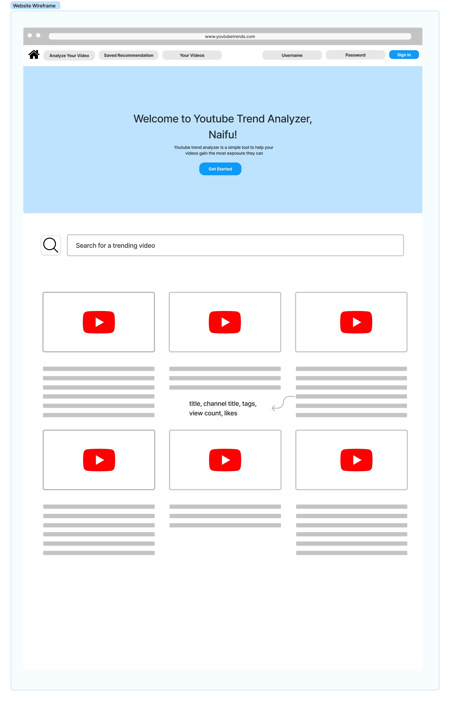

# Youtube Trend Analyzer

## **Project Summary**
Our web application aims to help social media creators, specifically Youtube creators, gain more knowledge on what will make their videos more successful. It’s meant to create a platform to share recommendations on videos and save those recommendations for the creators benefit. 

## **Databases/Realness**
We will be using the YouTube Trending Video Dataset (USA) which contains information about each trending video and is updated daily. This will be analyzed in order for the users to understand what they should add to their videos to make it more successful. 

We will create a “saved creator suggestions” dataset that contains each user's recommendations from our analyzing tool. This way, the user can go back to them later instead of analyzing the video again. 

We will create our own dataset incorporating the Youtube API so we are able to link video URLs to the video IDs given in the YouTube Trending Video Dataset (USA). This will also be useful for comments, search, and thumbnail resource types in order to get the information required to provide suggestions to the user.

Lastly, we will create a database to link a user to their own personal videos they have posted.

## **Usefulness**
The aim of our project is to give expanded functionality to the current YouTube creator tools. The tool can analyze a video idea and give suggestions on how the video can perform better, based on metrics provided by the user. Currently, this is not supported by the native YouTube creator studio, and other tools only provide suggestions for singular aspects of YouTube videos, such as the title. Our tool aims to provide suggestions for multiple aspects of the YouTube video, such as the tags, title, and the thumbnail. Additionally, it would also provide different suggestions depending on the country specified by the user. 

## **Functionality**
Our web application provides a centralized platform for aspiring Youtubers to analyze and learn from trending Youtube videos. At initial visit, users will be prompted to create an account or login with existing credentials. After login, the application will contain 3 tabs for searching videos, analyzing videos, and accessing user profiles respectively.

Initially, they will be presented with a page to search the trending videos dataset. Search results will be displayed as a scrollable list with title, channel title, tags, view count, likes, thumbnail (video player), and a checkbox to save each video. The search can be filtered by user preferences. In the second tab, users can input elements of their own video in order to receive suggestions of similar videos in the trending dataset. The search results will be displayed similar to the previous tab. The User Profile Tab will display the user’s analyzed videos as well as the saved videos. There will also be a button to logout at the top of the application.

## **Low-Fidelity Mockup**

## **Project Work Distribution**
Diya - responsible for working with the Youtube API and integrating this in our front end as well as creating the analyzing tool.

Violetta - front end development and login database as well as creating the analyzing tool.

Hoogan - front end development, database modification queries, trigger/stored procedure.

Zayaan - responsible for database interaction and SQL queries for search functionality as well as creating the analyzing tool.
